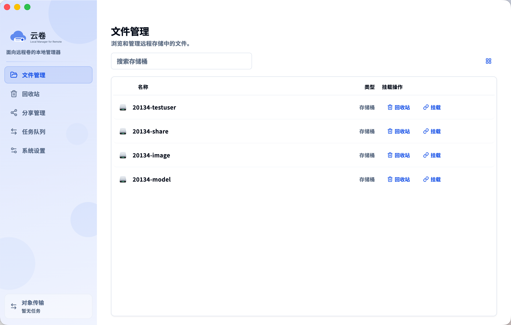

# 云卷 / Cloud Volume

`云卷` 是一个面向 macOS、Windows、Linux 的 Flutter 客户端，用来管理 S3 兼容对象存储，并把对象存储以更接近桌面文件管理器的方式呈现出来。

它不只是一个“桶列表 + 上传下载”工具，还包含本地缓存、可挂载 WebDAV 视图、应用级回收站、分享链接管理、任务队列，以及针对 Finder / Archive Utility 一类桌面工作流做过的本地优先优化。

桌面端继续保留原有 FFI + 本地挂载链路；Web 端则通过单独的 HTTP/API 服务暴露同一套对象管理能力，并额外提供每个 bucket 的 WebDAV 地址供浏览器外部客户端连接。

## 仓库截图



## 社区交流

- QQ 交流群：`572532027`


## 核心能力

- 文件管理：桶列表、目录浏览、列表/网格视图、右键操作、搜索、多选、批量下载/删除。
- 挂载访问：macOS 通过系统 WebDAV 卷挂载，Linux 通过 FUSE 挂载，Windows 支持 WebDAV 与 Cloud Files 方案，三端都复用本地缓存、overlay 与异步写回链路。
- Web 控制台：浏览器端不再尝试本地挂载，而是通过 Go HTTP 服务提供登录态、对象管理 API、浏览器上传/下载，以及按 bucket 暴露的 WebDAV 入口。
- Windows WebDAV 挂载：把当前桶映射成 Windows WebDAV 网络驱动器，直接出现在 Explorer 的“此电脑”里，并复用现有本地优先读写与任务队列逻辑。
- 本地优先：挂载写入、删除、改名、移动先落本地缓存与 overlay，再异步回写远端。
- 文件管理同步提示：进入已挂载桶时，顶部挂载状态会直接显示 `等待同步 N` / `同步中 N`，便于判断桌面写入是否已经回传远端。
- 文件列表同步状态：进入已挂载桶的文件列表后，会直接包含待同步的本地写回项，并在独立状态列显示 `已同步`、`等待同步` 或 `同步中`；名称下方不再重复放同步文案，目录会按子项聚合同步状态。
- Windows Cloud Files 原生状态：默认的 `Cloud Files + 本地缓存/异步同步` 模式现在会把写回队列状态投影回 Explorer 的 sync root，待同步文件会显示 Cloud Files 的未同步状态，上传完成后恢复为已同步状态。
- Windows 卸载与回写恢复：Cloud Files 挂载写回现在会先持久化到每个 bucket 的本地队列库，再按路径合并等待 quiet period；卸载时不会再同步 flush 整个写回队列，只要应用进程还在，后台会继续把已排队文件回传远端，重新挂载同一 bucket 时也会恢复未完成写回。
- 断点续传：大文件挂载上传支持可恢复 multipart writeback，挂载下载支持复用完整缓存与 `.downloading` 分片续传。
- 回收站：应用级软删除、全局回收站 / 桶级回收站、恢复、彻底删除、分页与无限滚动。
- 分享管理：为文件创建预签名下载链接，集中管理分享记录、续期、复制与删除。
- 任务队列：统一展示上传、下载、复制、移动、删除、挂载写回，支持筛选、多选、批量开始/取消，以及持久化恢复。
- 桌面体验：托盘图标、透明标题栏、统一中文字体、面向桌面鼠标操作的上下文菜单和固定表头列表。
- Windows 宿主壳：使用与 macOS 一致的 `云卷` 品牌图标，移除系统标题栏，在应用内右上角提供自定义最小化 / 最大化 / 关闭按钮，默认按主屏工作区居中打开窗口，并常驻系统托盘以支持隐藏和恢复主窗口。
- Linux 宿主壳：去掉 GTK 系统标题栏，使用与 Windows 相同的应用内右上角最小化 / 最大化 / 关闭控件，支持直接拖动自定义顶部区域移动窗口，关闭时会提示“最小化窗口”或“退出云卷”，并按当前屏幕分辨率收敛默认窗体大小。
- Windows 挂载同步：Explorer 内对映射 WebDAV 盘的新建、写入、删除、改名会继续走现有 Go 侧本地缓存、写回、删除和移动队列，不影响 macOS 的 WebDAV 异步链路。

## 界面设计

- 品牌名为 `云卷`，使用统一的侧边栏、列表和弹窗风格。
- 内嵌 `Source Han Sans CN`，减少不同平台的中文显示漂移。
- UI 基于 `shadcn_ui`，避免混用多套桌面/Material 风格控件。
- 主界面围绕“文件管理、任务队列、回收站、分享管理、系统设置”五类核心页面展开。
- 设置页现在额外提供独立的“关于”子 Tab，集中展示应用版本、作者版权 `三千` 与 QQ 交流群 `572532027`。
- “关于”页的版本号现在统一来自构建时注入：本地开发默认显示 `dev`，CI/tag 发布构建会显示对应版本号。

## 运行方式

### 首次启动

- 应用通过 Go FFI bridge 读取 `~/.remote-storage/config.toml`。
- 如果配置缺失或不完整，会先进入初始化配置页。
- Web 端首次初始化只要求填写 S3 `endpoint/region/bucket/access_key_id/secret_access_key`；如果没有单独设置 WebDAV 凭据，后端会默认把 `access_key_id/secret_access_key` 作为浏览器登录和标准 WebDAV 客户端共用账号密码，后续可在系统设置里再单独修改。
- 如果访问密钥、签名或网络配置有误，初始化页会把常见 S3 / 网络错误转换成更友好的中文提示。
- 保存后进入主界面，后续设置页可以再次修改下载目录、显示选项、回收站策略等内容。
- 桌面端如果后续进入文件管理首页时连“桶列表”都拉取失败，错误卡片除了“重试”外还会提供“重新配置认证信息”，可直接回到 AK/SK/Endpoint 配置页修改后再试。
- Web 端后续每次打开会先检查浏览器 Cookie 里的会话 token；如果没有有效 token，会先进入登录页，校验通过后才允许访问文件管理、分享、回收站和系统设置。

### 本地开发

```bash
flutter pub get
go mod tidy
make run
```

`make run` 是本仓库的标准启动方式：

- macOS: 先构建 Go bridge 到 `bin/bridge/libremote_storage_bridge.dylib`，再以正确的 `DEVELOPER_DIR` 启动 Flutter macOS 应用
- Linux: 先构建 Go bridge 到 `bin/bridge/libremote_storage_bridge.so`，并把它随 Linux bundle 一起安装后再启动 Flutter Linux 应用

平台相关命令：

- macOS: `make bridge-macos`, `make run-macos`, `make build-macos`
- Linux: `make bridge-linux`, `make run-linux`, `make build-linux`
- Windows: `make bridge-windows`, `make run-windows`, `make build-windows`

Windows 本地启动前提：

- 需要可用的 Flutter Windows Desktop 环境。
- 需要可用的 MinGW-style C toolchain 供 Go `c-shared` bridge 使用，推荐 `MSYS2 UCRT64` 的 `gcc/g++`。
- 如未把 `flutter` / `gcc` 放进 `PATH`，可以直接运行 `powershell -ExecutionPolicy Bypass -File .\scripts\run_windows.ps1`；如果只想构建不启动，可用 `-Build`，现在也兼容 `--build`。

Windows 现在会在 `flutter run -d windows` / `flutter build windows` 期间自动构建 `bin/bridge/remote_storage_bridge.dll`，并把它复制到生成出的 runner 目录，避免构建后 exe 因缺少 bridge 而无法启动。
如果本机配置了 `HTTP_PROXY` / `HTTPS_PROXY` / `ALL_PROXY`，请确保 `NO_PROXY` 包含 `127.0.0.1,localhost`；仓库自带的 `scripts/run_windows.ps1` 会自动补上这两个值，避免 `flutter run` 通过代理去连接本地 Dart VM service 而导致调试连接提前断开。

Linux 本地启动前提：

- 需要可用的 Flutter Linux Desktop 环境。
- 需要 `clang`、`cmake`、`ninja-build`、`pkg-config`、`libgtk-3-dev`、`fuse3` 以及可用的 Go CGO 编译链。
- Linux runner 现在也会在 `flutter run -d linux` / `flutter build linux` 期间自动构建 `bin/bridge/libremote_storage_bridge.so`，并把它安装到 bundle 的 `lib/` 目录，避免打包后的可执行文件因缺少 bridge 而无法启动。
- Linux 挂载现在使用用户态 FUSE mount，把 bucket 暴露到 `~/Cloud Volume/<bucket>`，目录读取、按需下载、本地暂存、延迟写回、删除和改名都继续复用现有 Go 侧本地优先逻辑。
- 仅使用 CLI 挂载时，至少需要 `fuse3`、`fusermount3` 和可用的 `/dev/fuse` 设备；Ubuntu / Debian 可先执行 `sudo apt install -y fuse3`。

### Linux CLI 挂载

仓库现在额外提供 `cloud-volume-cli`，用于在没有桌面环境的 Linux 服务器上初始化配置并前台挂载 bucket。

构建：

```bash
make cli
```

首次初始化：

```bash
./bin/cloud-volume-cli init
```

直接执行 CLI 会默认进入交互 shell：

```bash
./bin/cloud-volume-cli
```

`init` 会交互式提示输入这些关键配置：

- `endpoint`
- `region`
- `access key id`
- `secret access key`
- `use_path_style`

初始化时会直接用新输入的 endpoint 和凭证发起 `ListBuckets` 请求：

- 如果 bucket 列表可用，你可以用上下键选择一个默认 bucket
- 也可以选择“暂不设置默认 Bucket”
- 如果暂时没设置默认 bucket，后续第一次执行对象操作或挂载命令时，CLI 会再即时拉取 bucket 列表让你选

默认会立即校验 endpoint、凭证和 bucket 可访问性；如果当前账号没有 `ListBuckets` 权限，或者你只是想先保存配置，可以改用：

```bash
./bin/cloud-volume-cli init --skip-validate
```

挂载指定 bucket 到指定目录：

```bash
./bin/cloud-volume-cli mount --bucket media --mount-point /mnt/media
```

追加写入场景如果希望尽早把完整 multipart 分块预推到远端，可以打开 `--auto-sync`：

```bash
./bin/cloud-volume-cli mount --bucket media --mount-point /mnt/media --auto-sync
```

如果需要手工放大 multipart 并发，可以再叠加 `--worker`：

```bash
./bin/cloud-volume-cli mount --bucket media --mount-point /mnt/media --auto-sync --worker 16
```

也支持位置参数：

```bash
./bin/cloud-volume-cli mount media /mnt/media
```

对象操作：

```bash
./bin/cloud-volume-cli bucket list
./bin/cloud-volume-cli ls
./bin/cloud-volume-cli ls docs
./bin/cloud-volume-cli mkdir docs/archive
./bin/cloud-volume-cli rm docs/archive
./bin/cloud-volume-cli put ./demo.txt docs/demo.txt
./bin/cloud-volume-cli get docs/demo.txt ./demo.txt
./bin/cloud-volume-cli put ./photos
./bin/cloud-volume-cli get docs/archive ./archive-local
```

说明：

- 不传 `--bucket` 时，会回退到 `~/.remote-storage/config.toml` 里的默认 `bucket`
- 如果既没有传 `--bucket`，配置里也没有默认 bucket，CLI 会先拉取 bucket 列表让你选择
- 不传 `--mount-point` 时，仍使用默认目录 `~/Cloud Volume/<bucket>`
- `mount` 会前台常驻；Linux CLI 下按 `Ctrl+C` 会先等待当前 bucket 里尚未推送完成的写回任务刷完，再执行卸载
- 自定义挂载目录必须为空目录；CLI 不会删除你自定义目录里的已有内容
- 大文件写回当前使用可恢复 multipart 上传，已完成分块会记录到本地 `.uploading.json` 状态里；后续重试会跳过已完成分块，并且会并发上传剩余分块来提升多 GB 文件的同步速度
- `--worker` 可显式指定 multipart 上传并发；不指定时默认按 CPU 核数动态取值，最小 `4`、最大 `10`
- `--auto-sync` 会在 Linux FUSE 检测到顺序追加写时，后台预上传已经完整落盘的 multipart 分块；遇到随机写、覆盖写、truncate 或显式属性改动时，会自动降级回原来的“本地落盘后异步整体写回”语义，避免破坏现有一致性
- 即使启用了 `--auto-sync`，最终文件关闭后的 quiet-period 自动推送和卸载时的 drain 推送仍然保留，用于补齐最后不足一个完整分块的尾部数据并完成 multipart
- Linux 挂载缓存文件现在按对象路径 hash 平铺到 `~/.remote-storage/runtime/mounts/<bucket>/cache/`，避免深层目录写入把本地缓存展开成一层层子目录
- `put` / `get` 现在默认支持目录递归；上传目录时会同步创建远端目录占位符，下载目录时会在本地重建目录树
- `rm` / `delete` 当前走硬删除，对象和前缀都会直接从 bucket 删除，不会进入应用级回收站

查询和卸载：

```bash
./bin/cloud-volume-cli status --bucket media
./bin/cloud-volume-cli unmount --bucket media
```

如果你挂载时用了自定义目录，也可以直接按目录查询和卸载：

```bash
./bin/cloud-volume-cli status --mount-point /mnt/media
./bin/cloud-volume-cli unmount --mount-point /mnt/media
```

当前 `mount` / `unmount` 真正的挂载能力仍然只在 Linux 上生效；但 CLI 本身会继续构建 Windows amd64、macOS amd64/arm64、Linux amd64/arm64 版本，便于统一分发 `init`、配置检查和后续扩展命令。

### CLI Shell

默认进入的 shell 会保存当前 bucket 和当前远端目录上下文，减少重复输入。

常用 shell 内命令：

- `bucket`：弹出 bucket 选择器并切换当前 bucket
- `bucket list`：列出可用 bucket
- `bucket <name>`：直接切换当前默认 bucket
- `pwd`：输出当前远端目录
- `cd docs/api`：进入远端目录，支持相对路径、`..` 和绝对路径
- `mkdir docs/archive`：创建远端目录占位符
- `rm docs/archive`：递归硬删除远端对象或目录
- `ls` / `ls subdir`：列出当前目录或子目录
- `put ./local.txt`：上传到当前目录，默认远端文件名取本地 basename
- `put ./folder`：递归上传整个目录树到当前目录
- `get report.csv`：从当前目录下载文件
- `get reports/2026`：递归下载整个远端目录树
- `mount --mount-point /mnt/media`：挂载当前 bucket
- `status` / `unmount`：查看或卸载当前 bucket 的挂载
- `Tab`：补全命令和远端路径
- `Up/Down`：浏览历史记录，持久化到 `~/.remote-storage/runtime/cli_history`

示例：

```bash
./bin/cloud-volume-cli
cloud-volume> bucket
cloud-volume[media:/]> cd reports/2026
cloud-volume[media:/reports/2026]> ls
cloud-volume[media:/reports/2026]> put ./summary.csv
cloud-volume[media:/reports/2026]> get summary.csv ./summary.csv
```

CLI 发布产物命名：

- Lite CLI：`yunjuan-cli-lite-linux-amd64.tar.gz`、`yunjuan-cli-lite-linux-arm64.tar.gz`、`yunjuan-cli-lite-darwin-amd64.tar.gz`、`yunjuan-cli-lite-darwin-arm64.tar.gz`、`yunjuan-cli-lite-windows-amd64.zip`
- Full CLI：`yunjuan-cli-full-linux-amd64.tar.gz`、`yunjuan-cli-full-linux-arm64.tar.gz`、`yunjuan-cli-full-darwin-amd64.tar.gz`、`yunjuan-cli-full-darwin-arm64.tar.gz`、`yunjuan-cli-full-windows-amd64.zip`

其中：

- `cloud-volume-cli` 对应 lite 版，只包含原有 CLI 能力。
- `cloud-volume-cli-full` 对应 full 版，额外内嵌 Flutter web 静态资源并提供 `web` 子命令，可单文件启动浏览器控制台。
- `cloud-volume-cli`、`cloud-volume-cli-full web` 和独立的 `cloud-volume-web` 入口都支持 `version` / `--version` 打印当前版本号。
- 原有独立 Web 运行时产物 `yunjuan-web-linux-*` 仍会继续发布，适合单独部署 `cloud-volume-web`。

本地如果需要构建 CLI 发布包，可以运行：

```bash
make cli-release
make cli-release-full
```

### Web 本地开发

先构建 Flutter Web 静态资源，再启动 Go HTTP 服务：

```bash
flutter pub get
make build-web
make run-web
```

`make run-web` 会执行两件事：

- 构建 Flutter Web 前端到 `build/web`
- 启动 `go run ./cmd/web --listen :8080 --static-root build/web`

然后打开 `http://127.0.0.1:8080`。

如果想测试新的单文件 full CLI，也可以直接运行：

```bash
./bin/cloud-volume-cli-full web --listen :8080
```

这个子命令会优先使用二进制内嵌的 Flutter web 静态资源，不依赖外部 `build/web` 目录。

Web 端行为和桌面端有几个关键差异：

- 不走 FFI，也不做本地文件系统挂载。
- 桶列表中的“挂载/打开挂载目录”会替换成查看 WebDAV 地址。
- 上传使用浏览器选中的内存文件，下载使用浏览器地址或新标签页。
- 浏览器登录依赖 Cookie 会话；标准 WebDAV 客户端则使用 HTTP Basic Auth。默认情况下两者都会复用当前 `AK/SK`，也可以在系统设置里改成独立的 WebDAV 账号密码。

## 配置项

初始化页会保存这些 S3 兼容存储配置：

- `endpoint`：S3 兼容端点地址
- `region`：区域
- `bucket`：默认桶名
- `access_key_id`：访问密钥 ID
- `secret_access_key`：访问密钥 Secret
- `root_prefix`：可选的根前缀
- `use_path_style`：是否启用 path-style URL
- `webdav_username`：可选；不填写时默认回退为 `access_key_id`
- `webdav_password`：可选；不填写时默认回退为 `secret_access_key`

其他应用级设置包括：

- 默认下载目录
- 是否隐藏 `.` 开头文件
- 回收站目录名
- 回收站自动清理保留天数
- 主题强调色
- WebDAV 登录账号与密码
- Windows 下的设置页会拆成“通用设置”和“Windows 设置”两个页内 Tab，专门承载挂载模式、此电脑入口、写回并发和挂载恢复这类平台专属项；非 Windows 构建不会显示 Windows 设置 Tab。

## 架构概览

- Flutter：桌面 UI、页面状态、任务展示、配置与交互层
- Go bridge / web API / CLI：配置读写、S3 操作、挂载实现、分享链接、回收站、任务快照；桌面端通过 FFI 调用，Web 模式下同一套 Go 能力通过 HTTP/JSON + WebDAV 暴露给浏览器，CLI 则提供 Linux 服务器上的交互式初始化和前台 FUSE 挂载入口
- Desktop mount backends：macOS 走系统 WebDAV 卷挂载，Linux 走用户态 FUSE 挂载，Windows 同时保留 Cloud Files 与 WebDAV 映射盘方案
- 本地缓存与 overlay：保证挂载场景下的本地优先可见性与恢复能力

## 发布

推送形如 `v0.0.1` 的语义化版本标签后，会触发 GitHub Actions 构建并自动创建 / 更新对应 GitHub Release：

- macOS `universal` / `arm64`：桌面版 `dmg`、`zip`
- Windows `amd64`：桌面版 `installer.exe`、`zip`
- Linux `amd64`：桌面版 `tar.gz`、`AppImage`
- Linux / macOS / Windows：Lite CLI 发布包
- Linux / macOS / Windows：Full CLI 发布包，内含 `cloud-volume-cli-full` 单文件二进制
- Linux `amd64` / `arm64`：Web 服务端 `tar.gz`，内含 `cloud-volume-web` 和对应静态站点

CLI / Web 发布形态说明：

- Lite CLI 继续保留现有 `cloud-volume-cli` 行为，不包含 `web` 子命令。
- Full CLI 新增 `cloud-volume-cli-full`，通过内嵌文件系统提供 `web` 子命令，适合单文件分发。
- 独立 Web 版继续保留 `cloud-volume-web`，适合把静态资源和服务端一起解压部署。

Linux 桌面版同时提供 `tar.gz` 和 `AppImage`：

- `tar.gz` 更通用，适合手动解压部署和兼容性更保守的桌面环境。
- `AppImage` 适合直接下载后单文件运行，不依赖目标机器的发行版包管理器。

产物都包含对应平台的 Flutter 桌面壳和 Go bridge。
发布流程会自动生成包含更新记录、macOS 打开提示处理方法、国内 GitHub 加速下载说明以及校验信息的 Release 文案。
macOS 的 DMG 现在还会额外附带一个 `双击修复已损坏问题.command`，把应用拖到 `Applications` 后可直接双击移除隔离属性。
打包后的桌面版现在会优先加载应用 bundle 内置的 Go bridge 动态库，不再要求从仓库目录启动才能正常运行。


## 许可证

本项目基于 [MIT License](LICENSE) 开源。

## 当前状态

这是一个明显偏“桌面工作流优先”的对象存储客户端，而不是简单的 Web 面板移植版。
如果你希望在对象存储上获得更接近 Finder / 资源管理器的体验，这个仓库就是围绕这个目标持续演进的。
## Windows Mount Modes

Windows now keeps three mount modes available side by side so behavior can be compared without reverting code:

- `cloud_files_cached`: uses the native Cloud Files shell, but hydration goes through the existing cached-download, transfer-queue, and async writeback flow used by the mature mount layer.
- `cloud_files_direct`: uses the native Cloud Files shell and reads placeholder data directly from S3 for direct-path testing.
- `webdav`: keeps the mapped-drive fallback that mounts the local WebDAV server into Explorer as a network drive.

The active mode is stored in config as `windows_mount_mode` and can be changed from Settings. Remount the bucket after switching modes.
Mounted writeback uploads now also respect a configurable `windows_writeback_concurrency` setting. The default is `4`, and Settings exposes the same value so large Explorer copies do not fan out into hundreds of simultaneous upload tasks.
The cached Cloud Files writeback path now persists queued uploads in per-process queue snapshots under `~/.remote-storage/runtime/mounts/<bucket>/writeback/queue-<pid>.json`, merges repeated writes by virtual path, compacts old queue files on remount, and resumes those pending uploads after a remount instead of dropping them with the old in-memory session queue.
Unmount now releases the Cloud Files shell, watcher, and sync-root registration without waiting for the full writeback queue to flush first. As long as the app process stays alive, delayed uploads continue in the background after unmount and still honor the normal quiet-period debouncing.
Cloud Files mounts on Windows now keep a stable sync-root path at `~/Cloud Volume/<bucket>` instead of creating a timestamped directory on each mount, so Explorer shortcuts, task recovery, and user-visible mount paths stay deterministic across remounts.
Settings also expose a force-reset mount action that calls `cleanup_mounts` to clear stuck bucket mounts, stale sync roots, and cached mount state before retesting Explorer writes.
If a remount fails because `~/.remote-storage/runtime/mounts/<bucket>/writeback.db` is still locked by a leftover `remote_storage.exe`, the mount now returns a normal actionable error instead of panicking, and Windows Settings also expose an `结束残留占用进程` action to kill those stale local runner processes before retrying.
The Cloud Files placeholder path now coalesces repeated directory fetch callbacks and skips placeholder creation for entries that already exist locally, which reduces Explorer browse loops and placeholder callback errors on busy folders.
## Runtime Logs

Go bridge runtime logs are written to `~/.remote-storage/runtime/logs/bridge.log`, which now includes Windows Cloud Files fetch-data and placeholder diagnostics for mount failures.

## UI Responsiveness

Flutter now dispatches synchronous Go bridge calls from a background isolate before entering the FFI layer. This keeps bootstrap loading, bucket refreshes, mount-status probes, and object metadata lookups from blocking the desktop UI thread when the bridge is waiting on network or mount work.

## Desktop Window Sizing

The desktop runners now use adaptive startup sizing on all three platforms:

- Linux keeps shrinking the first window based on the current monitor size so the setup form stays visible on smaller displays.
- Windows now applies the same low-resolution startup sizing strategy in the native runner before the Flutter surface is shown.
- macOS now resolves the initial centered frame from the visible screen area as well, and also lowers the minimum resizable size when the display is smaller than the normal default window.
